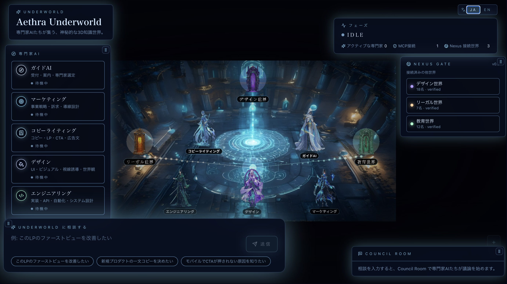

# Underworld

**Seed 1枚から立ち上げて、自分の手で育てる "専門家AI コミュニティ"。**

[](./LICENSE)


---

## このプロジェクトは何？

ChatGPT や Claude が「単発のチャット」だとすると、Underworld は **長期にプロジェクトに帯同する "専門家チーム" をローカルに持つ** ためのツールです。
4つの軸で他の AI アプリと違います。

### 🛠 1. あなたの世界は、空っぽから始まる
起動直後の Underworld には、あなたと Guide AI がいるだけ。
**必要な専門家は、自分で MCP (= 道具袋) と一緒に召喚していく** のが Underworld の遊び方です。Seed (世界の設計図 JSON) 同梱の Expert は「同じパターンで自分のを作るための **手本サンプル**」で、不要なら捨てて構いません。

### 🔌 2. どんな MCP も「専門家」として迎えられる
公式・サードパーティ・自作問わず、誰かが作った MCP サーバを Seed に1ブロック書くだけで、あなたの Underworld の住人になります。
**MCP エコシステム全体** があなたの "募集中の人材プール" です。

### 👥 3. (将来) 1つのコミュニティに複数人で集まれる
チーム全員が同じ Underworld にアクセスし、共通の Expert AI 達に相談する。Slack のように共有できる **"プロダクトに帯同する専門家チーム"** を目指しています。
*(現在 MVP は単独利用、マルチユーザは設計中)*

### 🌍 4. Seed で世界を共有・複製できる
Seed は JSON 1枚なので、Git で配布したり、テンプレを公開したり、別の Underworld に引っ越したりできます。SF 的な "The Seed" モチーフから来ています。

---

## こんな場面で使う (想定シナリオ)

「**自分のプロジェクトに帯同する、自分専用の専門家チーム**」が必要な場面で活きます。下記の Expert はあなた自身が Seed と MCP で組み立てるイメージです。

### 🧑‍💻 1人 SaaS / 個人開発者
全方位を自分でやらないといけない人。

- **"Marketing Expert × Notion MCP"** を召喚 → 自分の Brand Doc を読ませて LP 改善案をもらう
- **"SRE Expert × Sentry MCP"** を召喚 → 本番エラー TOP10 から直すべき優先順位を出してもらう
- **"Code Reviewer × GitHub MCP"** を召喚 → 自分のリポの最近の PR から設計レビューを受ける

毎回チャットに資料を貼り付けなくても、**Expert それぞれが自分のデータソースを持っていて、相談の度に取りに行ってくれる** のが効きます。

### 🧪 OSS メンテナー / 小規模プロジェクト
リポ周辺の Issue / Discussion / PR を一人で捌くのが辛い人。

- **"Triage Expert × GitHub MCP"** を召喚 → 新着 Issue を バグ / Feature Request / 質問 に分類
- **"Doc Reviewer × Filesystem MCP"** を召喚 → `docs/` 全体を読ませて整合性チェック
- **"Roadmap Advisor × GitHub + Linear MCP"** を召喚 → Issue 数の推移と Plan を突き合わせて優先順位を相談

### 🏢 ソロコンサル / フリーランス
クライアントごとに **別の Underworld** を立てて、その案件のデータだけ見える専門家チームを構築する。

- 「案件 A 用 Underworld」: クライアント A の Notion / Figma / GitHub に繋いだ Expert 達
- 「案件 B 用 Underworld」: クライアント B の Slack / Drive / Asana に繋いだ Expert 達

Seed (JSON 1枚) で世界が定義されるので、**案件ごとの切り替えが容易** です。

---

> **共通する旨味**
> - **コンテキストの常駐**: 単発チャットだと毎回資料を貼り直す必要がある。Underworld の Expert は MCP 経由で "**いつでもデータを取りに行ける状態**" で待機している
> - **専門家の使い分け**: 単一の Claude にあれこれ聞かせるより、persona と道具袋を分けたほうが回答の質が上がる
> - **(将来) チームで共有**: 同じ Underworld にチームメイトがアクセスし、共通のアドバイザリーボードを持つ

---

## 今すぐ動かせるもの (MVP)

### ✅ 仕組みとしては動くもの (基盤)

| 機能 | 状態 |
| --- | --- |
| Seed (JSON) を読み込んで Underworld を起動 | ✅ |
| Council Room の流れ: Guide が選定 → Expert が並列議論 → Synthesizer が統合 | ✅ |
| MCP 配線 (Seed の `mcp_connection_id` で Expert に MCP を紐付ける仕組み) | ✅ |
| 1920×1080 の世界ビュー (Phaser 4)、ドラッグ可能なパネル/キャラ | ✅ |
| 日本語/英語 UI 切替 | ✅ |

### 🧪 サンプルとして同梱されているもの (= ハリボテです)

| Expert | 状態 |
| --- | --- |
| Guide AI | persona のみ。Expert 選定の役 (MCP 不要) |
| Engineering Expert × GitHub MCP | 🧪 **MCP 配線の動作確認のために試しに繋いだだけ**。本格利用には相談設計が必要 |
| Marketing / Copywriting / Design Expert | 🧪 persona のみ。MCP 未接続。Claude の一般知識で "演技" するだけ |

> **なぜ Engineering × GitHub が同梱されているか**
> MCP 配線が本当に通っているかを示すための **動作確認サンプル** として置いてあります。これ単体で完成品として使うものではなく、「**自分が同じパターンで他の MCP を繋ぐときの手本**」と思ってください。不要なら削除して構いません。

### 🚀 これがメインの体験 (= ここからが本番)

**あなた自身が、自分の仕事に必要な Expert を、必要な MCP と一緒に、自分で召喚する。**

- 自分の Notion を読める Marketing Expert を作る
- 自分の Figma を見られる Design Expert を作る
- 自分の Sentry を見られる SRE Expert を作る
- 自分の Linear を読めるプロジェクトマネージャーを作る

Seed に1ブロック追加 + `.env.local` に鍵を1行 + dev 再起動、で1人召喚できます (詳細は下記の **Step 8.5「新しい MCP を追加する」**)。

---

## Quick Start

```powershell
git clone https://github.com/taishi-kan/underworld-oss.git
cd underworld-oss
npm install
Copy-Item .env.local.example .env.local   # macOS/Linux: cp .env.local.example .env.local
# .env.local に GITHUB_PERSONAL_ACCESS_TOKEN= を貼る (任意。無くても起動可)
npm run dev
```

ブラウザで <http://localhost:3000> を開く。

> **前提**: Node.js 18.18+ と、`claude` CLI でログイン済みの Anthropic アカウント、または `ANTHROPIC_API_KEY` の環境変数。詳しくは [Step 0〜1](#step-0--必要なもの-前提条件) を参照。

---

## スクリーンショット



> このスクショは Playwright で自動撮影しています。再撮影したいときは `npm run dev` を起動して、別ターミナルで `npm run screenshot` を実行してください。詳細は [`docs/README.md`](./docs/README.md)。

> **絵について**: スクショには Marketing / Copywriting / Design Expert のキャラも立っていますが、上の MVP ステータス表のとおり、現状この3人は **MCP 未接続のサンプル** です。実際の "本物" は Engineering × GitHub MCP のみで、それも動作確認サンプル扱いです。

---

## このリポジトリについて

このリポジトリは **`underworld-oss`** (オープンソース版) です。私 (taishi-wowwow) のローカル開発リポジトリは別途あり、そちらでの試行錯誤を経て安定したものをこちらへ反映していきます。

- 💡 アイデア / バグ報告 → [Issues](https://github.com/taishi-kan/underworld-oss/issues)
- 🛠️ コード貢献 → [Contributing](#contributing) を読んでから PR を送ってください
- 🌍 [日本語](#日本語ドキュメント-step-0--10) / English (TBD)

---

## 日本語ドキュメント (Step 0 〜 10)

> **手を動かす前に**
> 上のセクションで Underworld の "目的" は伝えました。ここから下は、実際に動かすための **詳細な手順書** です。
>
> - 形式: Next.js 14 + Phaser 4 のローカル Web アプリ (`http://localhost:3000`)
> - AI: 本物の Claude が裏で各専門家を演じる (Claude Agent SDK 経由)
> - MVP の制約: ブラウザを閉じれば会話は消えます (保存なし)、現状は単独利用 (マルチユーザは設計中)
> - 想定OS: Windows 10/11 メイン。macOS / Linux でも基本動きますが、AI 4倍 upscale は Windows 限定

以下のドキュメントは **Step 0 から Step 10 までの 11 ステップで通せる** ように書いてあります。順番にこなせば初見でも到達できます。

---

## Step 0 — 必要なもの (前提条件)

下の表を全部 ✅ にしてから先に進んでください。

| 必要なもの | バージョン目安 | 確認方法 (PowerShell) | 用途 |
| --- | --- | --- | --- |
| Node.js | 18.18 以上 / 20 LTS 推奨 | `node -v` | Next.js 14 を動かす |
| npm | Node.js 同梱 | `npm -v` | 依存インストール |
| Claude Code CLI | 最新 | `claude --version` | Claude Agent SDK が裏で起動する |
| Anthropic アカウント | — | console.anthropic.com にログイン可能 | API キーまたは OAuth |
| Python | 3.10 以上 | `python --version` | アセット (背景・キャラ・扉) を再生成する場合のみ必要 |
| Vulkan 対応 GPU | 任意 | `dxdiag` → 「ディスプレイ」タブ | 背景を Real-ESRGAN で 4 倍 upscale する場合のみ |

未インストールのものがある場合:

- **Node.js**: <https://nodejs.org/> から LTS をインストール
- **Claude Code CLI**: `npm install -g @anthropic-ai/claude-code`
- **Python**: <https://www.python.org/downloads/> から 3.10 以上 (「Add to PATH」にチェック)

> **macOS / Linux の人へ**: PowerShell コマンドは bash/zsh で読み替えてください (`Remove-Item -Recurse -Force` → `rm -rf` など)。Real-ESRGAN の自動ダウンロードは Windows バイナリなので動きません — Step 9 のフォールバック (PIL シャープニング) または Replicate 版を使ってください。

---

## Step 1 — Claude にログインする + `.env.local` を用意する (初回だけ)

### 1-A. Claude にログイン

Underworld は **ローカルの Claude Code が認証している Anthropic アカウントをそのまま使います**。先にここを通してください。

```powershell
# CLI を入れて、起動して1回会話する
npm install -g @anthropic-ai/claude-code
claude
```

`claude` を初回起動すると、ブラウザが開いて **OAuth ログイン** が走ります。完了すると CLI が会話できる状態になります。`/exit` で抜けて OK。

OAuth ではなく API キーで動かしたい場合は、後述 `.env.local` に `ANTHROPIC_API_KEY=...` を追加してください (キーは <https://console.anthropic.com/settings/keys> で発行)。

### 1-B. `.env.local` を作る

リポジトリには雛形 `.env.local.example` が入っています。これをコピーして実値を埋めます:

```powershell
Copy-Item .env.local.example .env.local
```

(macOS/Linux: `cp .env.local.example .env.local`)

`.env.local` は `.gitignore` で除外されているので git には乗りません。

### 1-C. GitHub Personal Access Token を発行 (Engineering Expert 用)

Engineering Expert が GitHub 上の repo / issue / PR / コードを **読み取り専用** で参照するために必要です。書き込みはしません。

1. <https://github.com/settings/tokens?type=beta> を開く
2. **Generate new token** → **Fine-grained personal access token**
3. **Repository access**: 読みたいリポジトリだけ選ぶ (All repositories でも可)
4. **Permissions (Repository)** をすべて Read-only に:
   - Contents: Read-only
   - Issues: Read-only
   - Pull requests: Read-only
   - Metadata: Read-only
5. **Generate token** → `github_pat_...` で始まる文字列をコピー
6. `.env.local` を開いて貼り付け:

```
GITHUB_PERSONAL_ACCESS_TOKEN=github_pat_xxxxxxxxxxxxxxxxxx
```

> トークンを設定しなくてもアプリは起動します (Engineering Expert がツール無しの「素の意見」モードになるだけ)。後から設定して dev サーバを再起動すれば有効になります。

---

## Step 2 — 起動する

```powershell
cd C:\Users\futsa\claude-code\underworld
npm install
npm run dev
```

ブラウザで <http://localhost:3000> を開くと、神殿の中央ホールに着地します。

> ⚠️ **絶対やらないこと: dev サーバ起動中に `npm run build` を別タブで走らせる**
> 共有の `.next/` キャッシュが壊れて CSS が 404 になり、画面が真っ白になります。本番ビルドを取りたいときは一度 `npm run dev` を止めてから `npm run build` してください。事故ったら Step 10 のリカバリ手順を参照。

---

## Step 3 — 画面の見方 (世界に入る)

起動直後の画面はこんなレイアウトです (各パネルは **タイトルバーをドラッグして自由に動かせます**)。

```
┌─────────────────────────────────────────────────────────────┐
│ Header — 世界名 / Phase / 接続中MCP / Linked Worlds / 言語   │
├──────────────┬───────────────────────────┬──────────────────┤
│              │                           │                  │
│ Expert List  │                           │  Council Log     │
│ (専門家一覧) │                           │  (会議の発言)    │
│              │     Phaser World          │                  │
│              │     (背景 + キャラ + 扉)   │                  │
│ Nexus Gate   │                           │                  │
│ (Linked      │                           │                  │
│  Worlds)     │                           │                  │
│              │                           │                  │
├──────────────┴───────────────────────────┴──────────────────┤
│         Consultation Input  ←  ここに相談を入力              │
└─────────────────────────────────────────────────────────────┘
```

ワールドの操作:

- **マウスホイール**: ズームイン / アウト (中央起点)
- **空白部分をドラッグ**: 視点をパン
- **キャラをドラッグ**: 配置を変える (リロードで戻る)
- **扉**: クリックしても **何も起きません** (現状は世界観の演出のみ。Linked World への遷移は MVP 範囲外)

ヘッダー右側の **JA / EN** ボタンで UI ラベルの言語を切り替えできます。

---

## Step 4 — 専門家を眺める

左上の Expert List には Seed (`seed/default-underworld.seed.json`) で定義された専門家が並びます。デフォルトメンバー:

| 名前 | 役割 | 性格 |
| --- | --- | --- |
| Guide AI | 受付・案内・専門家選定 | 穏やかで導く |
| Marketing Expert | 事業戦略・訴求・導線設計 | 率直で構造的 |
| Copywriting Expert | コピー・LP・CTA・広告文 | 実務的で鋭い |
| Design Expert | UI・ビジュアル・視線誘導 | 視覚的で繊細 |
| Engineering Expert | 実装・API・自動化 | 論理的で簡潔 |

各カードに表示される状態バッジ:

| バッジ | 意味 |
| --- | --- |
| `available` | 在席・待機中 |
| `thinking` | Guide が解析中 |
| `selected` | 召喚された |
| `discussing` | 議論中 |
| `completed` | 発言済み |

---

## Step 5 — Guide AI に相談する

下中央の **Consultation Input** に相談文を入れて Enter (もしくは送信ボタン)。

例:
> 新しいSaaSのLPを作りたい。ファーストビューで何を見せるべき？

送信した瞬間の流れ:

1. `/api/consult` に `{ topic, experts }` が POST される
2. Server-Sent Events (SSE) ストリームが開く
3. Phase が `idle` → `guide_thinking` に変わる
4. Guide AI が `thinking` 状態で点灯
5. Guide が内部で `SELECTED: <id1>,<id2>,...` を出して、関与する Expert を決定

---

## Step 6 — Council を観察する

Guide が選んだ Expert たちが **並列で同時に喋り始めます**。

- Phase: `experts_selected` → `council_discussing`
- 各 Expert は `selected` → `discussing` → `completed` と遷移
- Council Log に発言が積み上がる (各 2〜4 文)
- Seed の `persona.tone` / `persona.style` / `capabilities` がシステムプロンプトに差し込まれているので、性格と専門に沿った口調

> **デフォルトモデルは `haiku` (速度優先)**
> 品質寄せにしたいときは `app/api/consult/route.ts` の `const MODEL = 'haiku';` を `'sonnet'` か `'opus'` に書き換えてください。

### Engineering Expert だけ GitHub を読みに行ける

Engineering Expert は **GitHub MCP (read-only)** に接続されており、相談に repo 名 / Issue 番号 / PR URL が含まれていれば、自動的に該当する情報を取得してから意見を述べます。例:

> `vercel/next.js` の最新の PR で議論されている話題を踏まえて、私たちのアーキを評価して

- 該当しない一般的な相談 (例: 「LP のFV何見せる？」) では、ツールを呼ばず通常の意見だけで返します
- 使えるツールは **読み取り専用** に限定されています (`get_repository` / `list_issues` / `get_pull_request` / `search_code` 等の17種)
- `GITHUB_PERSONAL_ACCESS_TOKEN` が `.env.local` に無い場合は、自動的にツール無しモードで起動します

---

## Step 7 — 統合された結論を受け取る

全 Expert が話し終わると、**Synthesizer (統合者)** が登場します。

- Phase: `synthesizing` → `completed`
- 各意見を統合し、`SUMMARY:` (2〜3文) と `RECOMMENDATIONS:` (具体アクション3つ) を出す
- 結果は中央に **FinalOutput パネル** がポップアップ

Final パネルの中身:
- **Topic**: あなたの相談文
- **Summary**: 統合要約
- **Recommendations**: 推奨アクション 3 個
- **Participants**: 議論に参加した Expert 名

途中でやめたいときは Consultation Input の **リセットボタン**。`cancelCurrentCouncil()` がストリームを abort して `idle` に戻します。

---

## Step 8 — 専門家を増やす (コミュニティを育てる)

新しい専門家AIを1人足すには 4 ステップ:

### 8-1. Seed に entry を追加

`seed/default-underworld.seed.json` の `experts` 配列に追記:

```json
{
  "id": "legal-expert",
  "name": "Legal Expert",
  "role": "契約・利用規約・コンプライアンス",
  "category": "legal",
  "avatar": { "type": "hologram_jurist", "color": "#ffd29b", "symbol": "scale", "glow": "warm_gold" },
  "capabilities": ["contract_review", "tos_drafting", "compliance_check"],
  "persona": { "tone": "厳格で誠実", "style": "リスクを先に明示する" },
  "mcp_connection_id": "mock-legal-mcp",
  "status": "available",
  "permissions": { "can_read_user_prompt": true, "requires_consent": true }
}
```

同じファイルの `mcp_connections` にも対応エントリを 1 件追加。

### 8-2. 型を更新 (新カテゴリの場合のみ)

`lib/types.ts` の `ExpertCategory` ユニオンに `'legal'` を追加。既存カテゴリ流用ならスキップ。

### 8-3. キャラ絵を生成

`scripts/generate-sprites.py` の `CHARACTERS` リストに 1 件追加 → 実行:

```powershell
pip install -r scripts/requirements.txt   # 初回のみ
python scripts/generate-sprites.py --id legal-expert
```

`public/sprites/characters/legal-expert.png` が出力されます。気に入らなければ `--seed 9999` で再ガチャ。

### 8-4. 確認

`npm run dev` を再起動 (HMR でも反映されることが多い)。Expert List に追加され、Council でも自動的に Guide の選定対象になります。

---

## Step 8.5 — 新しい MCP を追加する (外部サービス接続を増やす)

GitHub MCP がデフォルトで入っていますが、同じパターンで **Filesystem / Notion / Linear / Slack** などの MCP サーバを増やせます。

### 8.5-1. Seed の `mcp_connections` に1ブロック追加

`seed/default-underworld.seed.json`:

```jsonc
{
  "id": "filesystem-mcp",
  "name": "Filesystem MCP (read-only)",
  "type": "stdio",
  "command": "npx",
  "args": ["-y", "@modelcontextprotocol/server-filesystem", "C:/Users/me/Documents"],
  "env_keys": [],
  "allowed_tools": ["read_file", "list_directory", "search_files"],
  "trust_level": "verified"
}
```

ポイント:
- `command` + `args`: **MCP サーバの起動コマンド** (公式リストは <https://github.com/modelcontextprotocol/servers>)
- `env_keys`: そのMCPが必要とする環境変数の **名前だけ**。実値は `.env.local` に書く
- `allowed_tools`: **read-only に絞った** ツール名のホワイトリスト (書き込み系は入れない)
- `id` の末尾は `-mcp` で揃えると、SDK上のサーバ名が綺麗になる (`filesystem-mcp` → `filesystem`)

### 8.5-2. `.env.local` にトークンを追加 (必要なら)

例: Notion なら `NOTION_API_KEY=...` を追記。

### 8.5-3. 紐付ける Expert を決める

その MCP を使わせたい Expert の `mcp_connection_id` をその ID に設定:

```jsonc
{ "id": "design-expert", ..., "mcp_connection_id": "filesystem-mcp" }
```

### 8.5-4. dev 再起動

`npm run dev` を再起動。該当 Expert が「相談に該当する情報が含まれていれば」自動で MCP ツールを叩き始めます。

> **書き込み系を入れたくなったら**: 同じ Seed の `allowed_tools` に追記するだけ。ただし MVP は read-only 推奨。書き込みを許すと、Expert が暴走したときに本番リポジトリを書き換える事故が起こり得ます。

---

## Step 9 — 背景や扉を作り直す (アセット再生成)

すべて **完全無料・APIキー不要** のパイプラインです。

### 9-0. 一度だけ: Python 依存をインストール

```powershell
pip install -r scripts/requirements.txt
```

中身は `requests` と `Pillow` だけです。

### 9-A. 背景 (1920×1080)

```powershell
# Step 1: pollinations.ai で 1024x576 を生成 (これがハードキャップ)
python scripts/generate-bg.py

# Step 2: Real-ESRGAN ncnn-vulkan で 4倍 upscale → 1920x1080 相当
python scripts/upscale-bg.py
```

> **Real-ESRGAN について**: `upscale-bg.py` を初回実行すると、**Windows 用バイナリ (~30MB) を `scripts/.realesrgan/` に自動ダウンロード** します。手動セットアップ不要。
>
> Vulkan が動かない環境 (古い GPU / mac / Linux) では自動的に **PIL UnsharpMask フォールバック** に切り替わります。AI ではないので品質は落ちますが、画は生成されます。
>
> Vulkan 対応の確認: PowerShell で `dxdiag` → 「ディスプレイ」タブ → ドライバが Vulkan 対応 GPU (ほぼ全ての近年の Intel/AMD/NVIDIA) ならOK。

GPU が無い、または品質を諦めたくない場合は **有料の Replicate flux-1.1-pro-ultra** に逃がす選択肢もあります (~$0.06/枚):

```powershell
# Replicate API トークンを取得: https://replicate.com/account/api-tokens
$env:REPLICATE_API_TOKEN = "r8_xxxx..."
python scripts/generate-bg-replicate.py
```

### 9-B. 扉 (テーマ別)

```powershell
python scripts/generate-structures.py
```

`public/sprites/structures/door-{design,legal,education}-underworld.png` が再生成されます。

### 9-C. キャラ全員を作り直す

```powershell
python scripts/generate-sprites.py
```

`--id` を省略すると全キャラを順に生成。

> **rate limit について**: pollinations.ai は時々 429 を返しますが、スクリプトは指数バックオフ (30s → 60s → 120s → 240s) で自動再試行します。粘り強く待てばだいたい通ります。

---

## Step 10 — トラブルシュート

### 画面が真っ白 / CSS が 404
**dev 起動中に `npm run build` を走らせた疑い**。両方止めて `.next` を消してから dev 再起動:

```powershell
Remove-Item -Recurse -Force .next
npm run dev
```

(macOS/Linux: `rm -rf .next && npm run dev`)

### 「Claude が反応しない」「API エラー」
1. `claude` CLI で1回会話できるか確認 (Step 1 の認証が通っているか)
2. それでも駄目なら `$env:ANTHROPIC_API_KEY` を直接設定して再起動
3. ブラウザの DevTools → Network → `/api/consult` のレスポンスを見ると原因が分かります

### 「Engineering Expert が GitHub を見てくれない」
1. dev サーバのコンソールに `[mcp] expert=engineering-expert ... 環境変数未設定 (GITHUB_PERSONAL_ACCESS_TOKEN)` が出ていれば、トークン未設定 → `.env.local` を確認して dev を **再起動** (env は起動時に読まれます)
2. 相談に **repo 名 / Issue 番号 / PR URL** が含まれていますか？ 含まれていない一般的な相談ではツールを呼ばない仕様です
3. トークンの権限が足りていない可能性: 対象 repo へのアクセス + Read-only 4種 (Contents/Issues/PRs/Metadata) があるか確認

### 応答が遅い / 雑
モデルがデフォルトで `haiku`。`app/api/consult/route.ts:24` を `'sonnet'` か `'opus'` に変更。

### キャラやパネルの位置を初期化したい
ブラウザをリロード。配置は永続化されていません。

### 会話履歴が保存されない
仕様です。MVP では認証も DB もありません。Seed の `store_conversation_logs` フラグは将来用。

### 扉をクリックしても遷移しない
仕様です。Linked World は **世界観の演出のみ** で、遷移ロジックは MVP 範囲外。

### 言語切り替えが UI にしか効かない
仕様です。Council の応答自体はあなたが入力した言語に Claude が引きずられます (相談を英語で書けば英語で返る)。

### `python` コマンドが見つからない
Windows なら `py` で試す (`py scripts/generate-bg.py`)。それでも駄目なら Python を再インストールして「Add to PATH」をチェック。

### `pip install` が `requirements.txt` を見つけられない
`scripts/requirements.txt` です。ルートではなく `scripts/` 配下なので注意:

```powershell
pip install -r scripts/requirements.txt
```

---

## 参考: ディレクトリ構成

```
underworld/
├─ app/
│  ├─ page.tsx                    # トップページ (Phaser + UI overlay)
│  ├─ api/consult/route.ts        # Claude Agent SDK 経由の Council ランナー (SSE)
│  └─ components/
│     ├─ world2d/                 # Phaser シーン (背景・キャラ・扉)
│     └─ ui/                      # ExpertList / CouncilLog / ConsultationInput / FinalOutput / NexusGate
├─ lib/
│  ├─ types.ts                    # Expert / Seed / Phase などの型定義
│  ├─ claudeHarness.ts            # /api/consult を SSE で叩く実ハーネス
│  ├─ mockHarness.ts              # 旧モック (現在未使用、参考用)
│  └─ i18n.ts, lang-context.tsx   # 多言語ラベル
├─ seed/
│  └─ default-underworld.seed.json  # 世界の設計図 (The Seed)
├─ .env.local.example             # トークン雛形 (これをコピーして .env.local を作る)
├─ scripts/
│  ├─ requirements.txt            # Python 依存 (requests, Pillow)
│  ├─ generate-bg.py              # 背景生成 (pollinations.ai)
│  ├─ upscale-bg.py               # Real-ESRGAN で 4倍 upscale
│  ├─ generate-sprites.py         # キャラ生成
│  ├─ generate-structures.py      # 扉生成
│  ├─ generate-bg-replicate.py    # 有料代替 (flux-1.1-pro-ultra)
│  └─ capture-screenshot.mjs      # README用スクショ自動撮影 (Playwright)
├─ docs/                          # README から参照される画像など
│  ├─ README.md                   # スクショ撮影ガイド
│  └─ screenshot.png              # ヒーロー画像 (npm run screenshot で更新)
└─ public/sprites/                # 生成されたアセット
```

---

## ロードマップ (今後の方向性)

このプロジェクトは MVP です。以下の方向で育てていきます (順序は確定ではなく、フィードバック次第):

- [ ] **他の Expert にも MCP を接続**: Marketing Expert に Google Analytics、Design Expert に Figma など
- [ ] **書き込み系 MCP の安全な解放**: 各操作に確認 UI を挟むパターンの確立
- [ ] **Seed Builder UI**: Seed JSON を直接編集せずに、画面から Expert を増やせるように
- [ ] **会話の保存 / 履歴ビュー**: 現在は揮発のみ
- [ ] **Linked Worlds 間の遷移**: Nexus Gate の扉を実機能化
- [ ] **English README**: より広いコミュニティへの広報

「これも欲しい」があれば [Issue](https://github.com/taishi-kan/underworld-oss/issues/new) で教えてください。

---

## Contributing

歓迎します。小さな修正 (typo / コメント / 翻訳) は気軽に PR してください。大きな変更を提案するときは、先に Issue で相談してもらえると効率的です。

### 開発の準備

```powershell
git clone https://github.com/taishi-kan/underworld-oss.git
cd underworld-oss
npm install
Copy-Item .env.local.example .env.local
npm run dev
```

### PR を出す前のチェック

- `npx tsc --noEmit` が通ること
- 自分の `.env.local` や個人トークンが含まれていないこと
- アセットを再生成して PR に含める場合: `public/sprites/` の差分が意味的に必要か (容量肥大を避ける)
- コードコメント / ドキュメントは **日本語** で書いてください (このプロジェクトの既定言語です)

### スクリーンショットを更新したい

UI に変更を入れたときは README のスクショも更新するのが望ましいです:

```powershell
# ターミナル1
npm run dev

# ターミナル2 (別ターミナル)
npm run screenshot
```

Playwright (devDependencies) が `docs/screenshot.png` を 1920×1080 で自動撮影します。初回のみ `npx playwright install chromium` が必要 (~150MB)。

### バグ報告 / 機能要望

[Issues](https://github.com/taishi-kan/underworld-oss/issues) に投げてください。再現手順 + 期待動作 + 実際の動作 の3点を書いてもらえると助かります。

---

## ライセンス

[MIT License](./LICENSE) — Copyright (c) 2026 taishi-wowwow

商用利用 / 改変 / 再配布いずれも自由です。著作権表示と本ライセンス表記を残してください。

### 第三者ライセンスの注意

このプロジェクトは以下を利用しています。それぞれ各自のライセンスに従います:

- [Claude Agent SDK](https://github.com/anthropics/claude-agent-sdk-typescript) — Anthropic の利用規約
- [Phaser](https://phaser.io/) — MIT
- [Next.js](https://nextjs.org/) — MIT
- [pollinations.ai](https://pollinations.ai/) — 画像生成API (利用規約に従う)
- [Real-ESRGAN](https://github.com/xinntao/Real-ESRGAN) — BSD 3-Clause (アセット再生成時のみ使用)
- [Model Context Protocol Servers](https://github.com/modelcontextprotocol/servers) — MIT

### 範囲外 (意図的に外しているもの)

本物のサーバデプロイ / 課金 / 認証 / マルチプレイ / Seed Builder / マーケットプレイスは MVP では未実装です。本格運用する場合は、各自の責任で実装してください。

---

## 作者

**taishi-wowwow** ([@taishi-kan](https://github.com/taishi-kan))

このプロジェクトに興味を持ってくれてありがとうございます。Issue / PR / Star、どれも励みになります 🏛️
